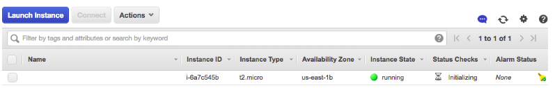
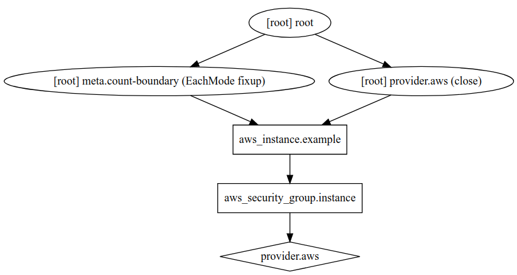

# Introduction to Terraform

## Write infrastructure as code with Terraform
1. Install [Terraform](https://www.terraform.io/).
1. Set your AWS credentials as the environment variables `AWS_ACCESS_KEY_ID` and `AWS_SECRET_ACCESS_KEY`.
1. Run `terraform init`.
1. Run `terraform plan`.
1. Run `terraform apply`.
1. After it's done deploying, the example will output URLs or IPs you can try out.
1. login to the [EC2 console](https://console.aws.amazon.com/ec2/v2/home), and you’ll see something like this:


## Modify infrastructure with Terraform
The Instance doesn’t have a name. To add one, you can add a tag to the EC2 instance:

* Modify main.tf:
```
    main.tf
    .
    .
    .
    resource "aws_instance" "example" {
       ami           = "ami-0c55b159cbfafe1f0"
       instance_type = "t2.micro"
       tags = {
           Name = "terraform-example"
       }
    }
```
* Run `terraform apply` again.
* Refresh your EC2 console.

## Deploy a single WebServer
```
#!/bin/bash
echo "Hello, World" > index.html
nohup busybox httpd -f -p 8080 &
```
This is a bash script that writes the text “Hello, World” into index.html and runs a web server on port 8080 using busybox (which is installed by default on Ubuntu) to serve that file at the URL “/”. We wrap the busybox command with nohup to ensure the web server keeps running even after this script exits and put an & at the end of the command so the web server runs in a background process and the script can exit rather than being blocked forever by the web server.

How do you get the EC2 Instance to run this script? we’re going to run the script above as part of the EC2 Instance’s User Data, which AWS will execute when the instance is booting:


* In main.tf modify the resource 'example' as follow:
```
    resource "aws_instance" "example" {
      ami           = "ami-0c55b159cbfafe1f0"
      instance_type = "t2.micro"
      user_data = <<-EOF
                  #!/bin/bash
                  echo "Hello, World" > index.html
                  nohup busybox httpd -f -p 8080 &
                  EOF
      tags = {
        Name = "terraform-example"
      }
    }
```
You need to do one more thing before this web server works. By default, AWS does not allow any incoming or outgoing traffic from an EC2 Instance. To allow the EC2 Instance to receive traffic on port 8080, you need to create a security group:
```
    resource "aws_security_group" "instance" {
      name = "terraform-example-instance"
      ingress {
        from_port   = 8080
        to_port     = 8080
        protocol    = "tcp"
        cidr_blocks = ["0.0.0.0/0"]
      }
    }
```
Simply creating a security group isn’t enough; you also need to tell the EC2 Instance to actually use it by passing the ID of the security group into the vpc_security_group_ids argument of the aws_instance resource. To do that,
you first need to learn about Terraform expressions.
One particularly useful type of expression is a reference, which allows you to access values from other parts of your code. To access the ID of the security group resource, you are going to need to use a resource attribute reference,
which uses the following syntax:
```
    <PROVIDER>_<TYPE>.<NAME>.<ATTRIBUTE>
```
Where `PROVIDER` is the name of the provider (e.g., `aws`), `TYPE` is the type of resource (e.g., `security_group`), `NAME` is the name of that resource (e.g., the security group is named `"instance"`), and `ATTRIBUTE` is either one of the arguments of that resource (e.g., `name`) or one of the attributes exported by the resource (you can find the list of available attributes in the documentation for each resource—e.g., here are the [attributes for aws_security_group](https://www.terraform.io/docs/providers/aws/r/security_group.html#attributes-reference)). The security group exports an attribute called `id`, so the expression to reference it will look like this:
```
    aws_security_group.instance.id
```
You can use this security group ID in the `vpc_security_group_ids` parameter of the `aws_instance`:
```
    resource "aws_instance" "example" {
      ami                    = "ami-0c55b159cbfafe1f0"
      instance_type          = "t2.micro"
      vpc_security_group_ids = [aws_security_group.instance.id]
      user_data = <<-EOF
                  #!/bin/bash
                  echo "Hello, World" > index.html
                  nohup busybox httpd -f -p 8080 &
                  EOF
      tags = {
        Name = "terraform-example"
      }
    }
```
When you add a reference from one resource to another, you create an implicit dependency. Terraform parses these dependencies, builds a dependency graph from them, and uses that to automatically figure out in what order it should create resources. Execute
```
terraform graph
```
Copy the output, in your browser access to [webgraphviz](http://www.webgraphviz.com/) and paste the output and generate the graph.


Execute `terraform apply`
In the description panel in the EC2 Console , you’ll also see the public IP address of this EC2 Instance. Give it a minute or two to boot up and then use a web browser or a tool like curl to make an HTTP request to this IP address at port 8080:
```
$ curl http://<EC2_INSTANCE_PUBLIC_IP>:8080
Hello, World
```
You now have a working web server running in AWS!

## Using Variables in Terraform

### Using input Variables in Terraform
You may have noticed that the web server code has the port 8080 duplicated in both the security group and the User Data configuration. This violates the Don’t Repeat Yourself (DRY) principle: every piece of knowledge must have a single, unambiguous, authoritative representation within a system. If you have the port number copy/pasted in two places, it’s too easy to update it in one place but forget to make the same change in the other place.
To allow you to make your code more DRY and more configurable, Terraform allows you to define input variables. The syntax for declaring a variable is:
```
variable "NAME" {
 [CONFIG ...]
}
```
Create a file variables.tf with:
```
variable "server_port" {
  description = "The port the server will use for HTTP requests"
  type        = number
}
```


Note that the server_port input variable has no default, so if you run the apply command now, Terraform will interactively prompt you to enter a value for server_port and show you the description of the variable:
```
$ terraform apply
var.server_port
  The port the server will use for HTTP requests
  Enter a value:
```
If you don’t want to deal with an interactive prompt, you can provide a value for the variable via the -var command-line option:
```
$ terraform apply -var "server_port=8080"
```
You could also set the variable via an environment variable named `TF_VAR_<name>` where `<name>` is the name of the variable you’re trying to set:
```
$ export TF_VAR_server_port=8080
$ terraform apply
```
And if you don’t want to deal with remembering extra command-line arguments every time you run plan or apply, you can specify a default value (in .tf file):
```
variable "server_port" {
  description = "The port the server will use for HTTP requests"
  type        = number
  default     = 8080
}
```
To use the value from an input variable in your Terraform code, you can use a new type of expression called a variable reference, which has the following syntax:

```
var.<VARIABLE_NAME>

```
Modify main.tf using the variable `server_port`:
```
resource "aws_security_group" "instance" {
  name = "terraform-example-instance"
  ingress {
    from_port   = var.server_port
    to_port     = var.server_port
    protocol    = "tcp"
    cidr_blocks = ["0.0.0.0/0"]
  }
}
```
To use a reference inside of a string literal, you need to use a new type of expression called an interpolation, which has the following syntax:
```
"${...}"
```
Modify the definition of the AWS EC2 instance as follow:
``` 
 user_data = <<-EOF
              #!/bin/bash
              echo "Hello, World" > index.html
              nohup busybox httpd -f -p "${var.server_port}" &
              EOF
```

### Using output variables in Terraform
In addition to input variables, Terraform also allows you to define output variables with the following syntax:
```
output "<NAME>" {
 value = <VALUE>
 [CONFIG ...]
}
```
For example, instead of having to manually poke around the EC2 console to find the IP address of your server, you can provide the IP address as an output variable.
Create a file outputs.tf with:
```
output "public_ip" {
  value       = aws_instance.example.public_ip
  description = "The public IP of the web server"
}
```
Execute `terraform apply`
```
$ terraform apply
(...)
aws_security_group.instance: Refreshing state... 
aws_instance.example: Refreshing state...
Apply complete! Resources: 0 added, 0 changed, 0 destroyed.
Outputs:
public_ip = 54.174.13.5
```
As you can see, output variables show up in the console after you run terraform apply, which users of your Terraform code may find useful (e.g., you now know what IP to test once the web server is deployed). You can
also use the terraform output command to list all outputs without applying any changes:
```
$ terraform output
public_ip = 54.174.13.5
```
And you can run `terraform output <OUTPUT_NAME>` to see the value of a specific output called `<OUTPUT_NAME>`:
```
$ terraform output public_ip
54.174.13.5
```
## Destroy infrastructure with Terraform
1. To clean up and delete all resources after you're done, run `terraform destroy`.


